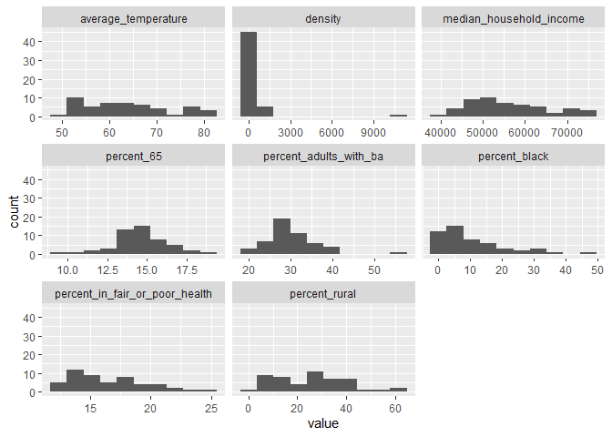

```r
df <-
  here::here("data", "covid_data_final.csv") %>%
  read_csv() %>%
  select(
    state,
    median_household_income,
    percent_adults_with_ba,
    percent_in_fair_or_poor_health,
    percent_black,
    density,
    percent_rural,
    percent_65,
    average_temperature,
    governor_political_affiliation
  ) %>% 
  group_by(state) %>% 
  distinct(
    state,
    median_household_income,
    percent_adults_with_ba,
    percent_in_fair_or_poor_health,
    percent_black,
    density,
    percent_rural,
    percent_65,
    average_temperature,
    governor_political_affiliation
  ) %>% 
  filter(state != "VI") %>% 
  ungroup()
```


```r
df %>% 
  pivot_longer(-c(state, governor_political_affiliation)) %>% 
  ggplot(aes(x = value)) + 
  geom_histogram(bins = 10) + 
  facet_wrap(~ name, scales = "free_x")
```

```
Warning: Removed 2 rows containing non-finite values (stat_bin).
```

<!-- -->


```r
df %>% 
  select(-c(state, governor_political_affiliation)) %>% 
  pastecs::stat.desc() %>% 
  rownames_to_column("stat") %>% 
  filter(stat %in% c("nbr.val",
                          "min",
                          "max",
                          "mean", 
                          "median",
                          "std.dev")) %>% 
  gt() %>% 
  tab_header(title = "Descriptive Statistics",
             subtitle = "Controls") %>% 
  cols_label(stat = "Statistic", 
             median_household_income = "Median Household Income",
             percent_adults_with_ba = "Adults w/ BA (%)",
             percent_in_fair_or_poor_health = "Fair of Poor Health (%)",
             percent_black = "Black (%)",
             density = "Pop Density",
             percent_rural = "Rural Pop (%)",
             percent_65 = "Age > 65 (%)",
             average_temperature = "Average Temperature"
  ) %>% 
  cols_align("center") 
```

<!--html_preserve--><style>html {
  font-family: -apple-system, BlinkMacSystemFont, 'Segoe UI', Roboto, Oxygen, Ubuntu, Cantarell, 'Helvetica Neue', 'Fira Sans', 'Droid Sans', Arial, sans-serif;
}

#qauzyvnmhg .gt_table {
  display: table;
  border-collapse: collapse;
  margin-left: auto;
  margin-right: auto;
  color: #333333;
  font-size: 16px;
  font-weight: normal;
  font-style: normal;
  background-color: #FFFFFF;
  width: auto;
  border-top-style: solid;
  border-top-width: 2px;
  border-top-color: #A8A8A8;
  border-right-style: none;
  border-right-width: 2px;
  border-right-color: #D3D3D3;
  border-bottom-style: solid;
  border-bottom-width: 2px;
  border-bottom-color: #A8A8A8;
  border-left-style: none;
  border-left-width: 2px;
  border-left-color: #D3D3D3;
}

#qauzyvnmhg .gt_heading {
  background-color: #FFFFFF;
  text-align: center;
  border-bottom-color: #FFFFFF;
  border-left-style: none;
  border-left-width: 1px;
  border-left-color: #D3D3D3;
  border-right-style: none;
  border-right-width: 1px;
  border-right-color: #D3D3D3;
}

#qauzyvnmhg .gt_title {
  color: #333333;
  font-size: 125%;
  font-weight: initial;
  padding-top: 4px;
  padding-bottom: 4px;
  border-bottom-color: #FFFFFF;
  border-bottom-width: 0;
}

#qauzyvnmhg .gt_subtitle {
  color: #333333;
  font-size: 85%;
  font-weight: initial;
  padding-top: 0;
  padding-bottom: 4px;
  border-top-color: #FFFFFF;
  border-top-width: 0;
}

#qauzyvnmhg .gt_bottom_border {
  border-bottom-style: solid;
  border-bottom-width: 2px;
  border-bottom-color: #D3D3D3;
}

#qauzyvnmhg .gt_col_headings {
  border-top-style: solid;
  border-top-width: 2px;
  border-top-color: #D3D3D3;
  border-bottom-style: solid;
  border-bottom-width: 2px;
  border-bottom-color: #D3D3D3;
  border-left-style: none;
  border-left-width: 1px;
  border-left-color: #D3D3D3;
  border-right-style: none;
  border-right-width: 1px;
  border-right-color: #D3D3D3;
}

#qauzyvnmhg .gt_col_heading {
  color: #333333;
  background-color: #FFFFFF;
  font-size: 100%;
  font-weight: normal;
  text-transform: inherit;
  border-left-style: none;
  border-left-width: 1px;
  border-left-color: #D3D3D3;
  border-right-style: none;
  border-right-width: 1px;
  border-right-color: #D3D3D3;
  vertical-align: bottom;
  padding-top: 5px;
  padding-bottom: 6px;
  padding-left: 5px;
  padding-right: 5px;
  overflow-x: hidden;
}

#qauzyvnmhg .gt_column_spanner_outer {
  color: #333333;
  background-color: #FFFFFF;
  font-size: 100%;
  font-weight: normal;
  text-transform: inherit;
  padding-top: 0;
  padding-bottom: 0;
  padding-left: 4px;
  padding-right: 4px;
}

#qauzyvnmhg .gt_column_spanner_outer:first-child {
  padding-left: 0;
}

#qauzyvnmhg .gt_column_spanner_outer:last-child {
  padding-right: 0;
}

#qauzyvnmhg .gt_column_spanner {
  border-bottom-style: solid;
  border-bottom-width: 2px;
  border-bottom-color: #D3D3D3;
  vertical-align: bottom;
  padding-top: 5px;
  padding-bottom: 6px;
  overflow-x: hidden;
  display: inline-block;
  width: 100%;
}

#qauzyvnmhg .gt_group_heading {
  padding: 8px;
  color: #333333;
  background-color: #FFFFFF;
  font-size: 100%;
  font-weight: initial;
  text-transform: inherit;
  border-top-style: solid;
  border-top-width: 2px;
  border-top-color: #D3D3D3;
  border-bottom-style: solid;
  border-bottom-width: 2px;
  border-bottom-color: #D3D3D3;
  border-left-style: none;
  border-left-width: 1px;
  border-left-color: #D3D3D3;
  border-right-style: none;
  border-right-width: 1px;
  border-right-color: #D3D3D3;
  vertical-align: middle;
}

#qauzyvnmhg .gt_empty_group_heading {
  padding: 0.5px;
  color: #333333;
  background-color: #FFFFFF;
  font-size: 100%;
  font-weight: initial;
  border-top-style: solid;
  border-top-width: 2px;
  border-top-color: #D3D3D3;
  border-bottom-style: solid;
  border-bottom-width: 2px;
  border-bottom-color: #D3D3D3;
  vertical-align: middle;
}

#qauzyvnmhg .gt_from_md > :first-child {
  margin-top: 0;
}

#qauzyvnmhg .gt_from_md > :last-child {
  margin-bottom: 0;
}

#qauzyvnmhg .gt_row {
  padding-top: 8px;
  padding-bottom: 8px;
  padding-left: 5px;
  padding-right: 5px;
  margin: 10px;
  border-top-style: solid;
  border-top-width: 1px;
  border-top-color: #D3D3D3;
  border-left-style: none;
  border-left-width: 1px;
  border-left-color: #D3D3D3;
  border-right-style: none;
  border-right-width: 1px;
  border-right-color: #D3D3D3;
  vertical-align: middle;
  overflow-x: hidden;
}

#qauzyvnmhg .gt_stub {
  color: #333333;
  background-color: #FFFFFF;
  font-size: 100%;
  font-weight: initial;
  text-transform: inherit;
  border-right-style: solid;
  border-right-width: 2px;
  border-right-color: #D3D3D3;
  padding-left: 12px;
}

#qauzyvnmhg .gt_summary_row {
  color: #333333;
  background-color: #FFFFFF;
  text-transform: inherit;
  padding-top: 8px;
  padding-bottom: 8px;
  padding-left: 5px;
  padding-right: 5px;
}

#qauzyvnmhg .gt_first_summary_row {
  padding-top: 8px;
  padding-bottom: 8px;
  padding-left: 5px;
  padding-right: 5px;
  border-top-style: solid;
  border-top-width: 2px;
  border-top-color: #D3D3D3;
}

#qauzyvnmhg .gt_grand_summary_row {
  color: #333333;
  background-color: #FFFFFF;
  text-transform: inherit;
  padding-top: 8px;
  padding-bottom: 8px;
  padding-left: 5px;
  padding-right: 5px;
}

#qauzyvnmhg .gt_first_grand_summary_row {
  padding-top: 8px;
  padding-bottom: 8px;
  padding-left: 5px;
  padding-right: 5px;
  border-top-style: double;
  border-top-width: 6px;
  border-top-color: #D3D3D3;
}

#qauzyvnmhg .gt_striped {
  background-color: rgba(128, 128, 128, 0.05);
}

#qauzyvnmhg .gt_table_body {
  border-top-style: solid;
  border-top-width: 2px;
  border-top-color: #D3D3D3;
  border-bottom-style: solid;
  border-bottom-width: 2px;
  border-bottom-color: #D3D3D3;
}

#qauzyvnmhg .gt_footnotes {
  color: #333333;
  background-color: #FFFFFF;
  border-bottom-style: none;
  border-bottom-width: 2px;
  border-bottom-color: #D3D3D3;
  border-left-style: none;
  border-left-width: 2px;
  border-left-color: #D3D3D3;
  border-right-style: none;
  border-right-width: 2px;
  border-right-color: #D3D3D3;
}

#qauzyvnmhg .gt_footnote {
  margin: 0px;
  font-size: 90%;
  padding: 4px;
}

#qauzyvnmhg .gt_sourcenotes {
  color: #333333;
  background-color: #FFFFFF;
  border-bottom-style: none;
  border-bottom-width: 2px;
  border-bottom-color: #D3D3D3;
  border-left-style: none;
  border-left-width: 2px;
  border-left-color: #D3D3D3;
  border-right-style: none;
  border-right-width: 2px;
  border-right-color: #D3D3D3;
}

#qauzyvnmhg .gt_sourcenote {
  font-size: 90%;
  padding: 4px;
}

#qauzyvnmhg .gt_left {
  text-align: left;
}

#qauzyvnmhg .gt_center {
  text-align: center;
}

#qauzyvnmhg .gt_right {
  text-align: right;
  font-variant-numeric: tabular-nums;
}

#qauzyvnmhg .gt_font_normal {
  font-weight: normal;
}

#qauzyvnmhg .gt_font_bold {
  font-weight: bold;
}

#qauzyvnmhg .gt_font_italic {
  font-style: italic;
}

#qauzyvnmhg .gt_super {
  font-size: 65%;
}

#qauzyvnmhg .gt_footnote_marks {
  font-style: italic;
  font-size: 65%;
}
</style>
<div id="qauzyvnmhg" style="overflow-x:auto;overflow-y:auto;width:auto;height:auto;"><table class="gt_table">
  <thead class="gt_header">
    <tr>
      <th colspan="9" class="gt_heading gt_title gt_font_normal" style>Descriptive Statistics</th>
    </tr>
    <tr>
      <th colspan="9" class="gt_heading gt_subtitle gt_font_normal gt_bottom_border" style>Controls</th>
    </tr>
  </thead>
  <thead class="gt_col_headings">
    <tr>
      <th class="gt_col_heading gt_columns_bottom_border gt_center" rowspan="1" colspan="1">Statistic</th>
      <th class="gt_col_heading gt_columns_bottom_border gt_center" rowspan="1" colspan="1">Median Household Income</th>
      <th class="gt_col_heading gt_columns_bottom_border gt_center" rowspan="1" colspan="1">Adults w/ BA (%)</th>
      <th class="gt_col_heading gt_columns_bottom_border gt_center" rowspan="1" colspan="1">Fair of Poor Health (%)</th>
      <th class="gt_col_heading gt_columns_bottom_border gt_center" rowspan="1" colspan="1">Black (%)</th>
      <th class="gt_col_heading gt_columns_bottom_border gt_center" rowspan="1" colspan="1">Pop Density</th>
      <th class="gt_col_heading gt_columns_bottom_border gt_center" rowspan="1" colspan="1">Rural Pop (%)</th>
      <th class="gt_col_heading gt_columns_bottom_border gt_center" rowspan="1" colspan="1">Age &gt; 65 (%)</th>
      <th class="gt_col_heading gt_columns_bottom_border gt_center" rowspan="1" colspan="1">Average Temperature</th>
    </tr>
  </thead>
  <tbody class="gt_table_body">
    <tr>
      <td class="gt_row gt_center">nbr.val</td>
      <td class="gt_row gt_center">51</td>
      <td class="gt_row gt_center">51.00</td>
      <td class="gt_row gt_center">51.00</td>
      <td class="gt_row gt_center">51.0</td>
      <td class="gt_row gt_center">51.00</td>
      <td class="gt_row gt_center">51.0</td>
      <td class="gt_row gt_center">51.00</td>
      <td class="gt_row gt_center">49.00</td>
    </tr>
    <tr>
      <td class="gt_row gt_center">min</td>
      <td class="gt_row gt_center">40528</td>
      <td class="gt_row gt_center">19.60</td>
      <td class="gt_row gt_center">12.00</td>
      <td class="gt_row gt_center">0.4</td>
      <td class="gt_row gt_center">1.29</td>
      <td class="gt_row gt_center">0.0</td>
      <td class="gt_row gt_center">9.56</td>
      <td class="gt_row gt_center">50.76</td>
    </tr>
    <tr>
      <td class="gt_row gt_center">max</td>
      <td class="gt_row gt_center">76067</td>
      <td class="gt_row gt_center">55.40</td>
      <td class="gt_row gt_center">24.40</td>
      <td class="gt_row gt_center">47.4</td>
      <td class="gt_row gt_center">10794.58</td>
      <td class="gt_row gt_center">61.3</td>
      <td class="gt_row gt_center">19.01</td>
      <td class="gt_row gt_center">82.45</td>
    </tr>
    <tr>
      <td class="gt_row gt_center">median</td>
      <td class="gt_row gt_center">54384</td>
      <td class="gt_row gt_center">29.00</td>
      <td class="gt_row gt_center">15.80</td>
      <td class="gt_row gt_center">7.1</td>
      <td class="gt_row gt_center">106.26</td>
      <td class="gt_row gt_center">25.8</td>
      <td class="gt_row gt_center">14.57</td>
      <td class="gt_row gt_center">62.75</td>
    </tr>
    <tr>
      <td class="gt_row gt_center">mean</td>
      <td class="gt_row gt_center">56031</td>
      <td class="gt_row gt_center">30.04</td>
      <td class="gt_row gt_center">16.48</td>
      <td class="gt_row gt_center">10.9</td>
      <td class="gt_row gt_center">407.01</td>
      <td class="gt_row gt_center">25.9</td>
      <td class="gt_row gt_center">14.54</td>
      <td class="gt_row gt_center">63.51</td>
    </tr>
    <tr>
      <td class="gt_row gt_center">std.dev</td>
      <td class="gt_row gt_center">9406</td>
      <td class="gt_row gt_center">6.12</td>
      <td class="gt_row gt_center">3.08</td>
      <td class="gt_row gt_center">10.7</td>
      <td class="gt_row gt_center">1506.64</td>
      <td class="gt_row gt_center">14.9</td>
      <td class="gt_row gt_center">1.76</td>
      <td class="gt_row gt_center">9.29</td>
    </tr>
  </tbody>
  
  
</table></div><!--/html_preserve-->


 


```r
df %>% 
  select(governor_political_affiliation) %>% 
  summarytools::freq()
```

```
Registered S3 method overwritten by 'pryr':
  method      from
  print.bytes Rcpp
```

```
Frequencies  
df$governor_political_affiliation  
Type: Character  

                   Freq   % Valid   % Valid Cum.   % Total   % Total Cum.
---------------- ------ --------- -------------- --------- --------------
        Democrat     25     49.02          49.02     49.02          49.02
      Republican     26     50.98         100.00     50.98         100.00
            <NA>      0                               0.00         100.00
           Total     51    100.00         100.00    100.00         100.00
```

